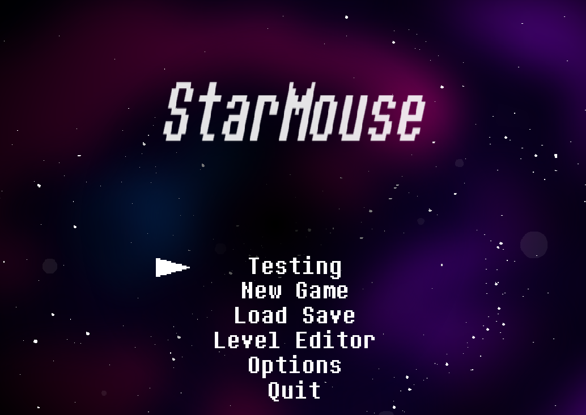
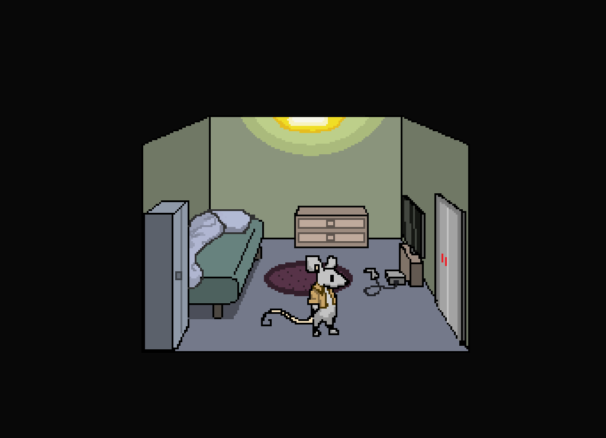
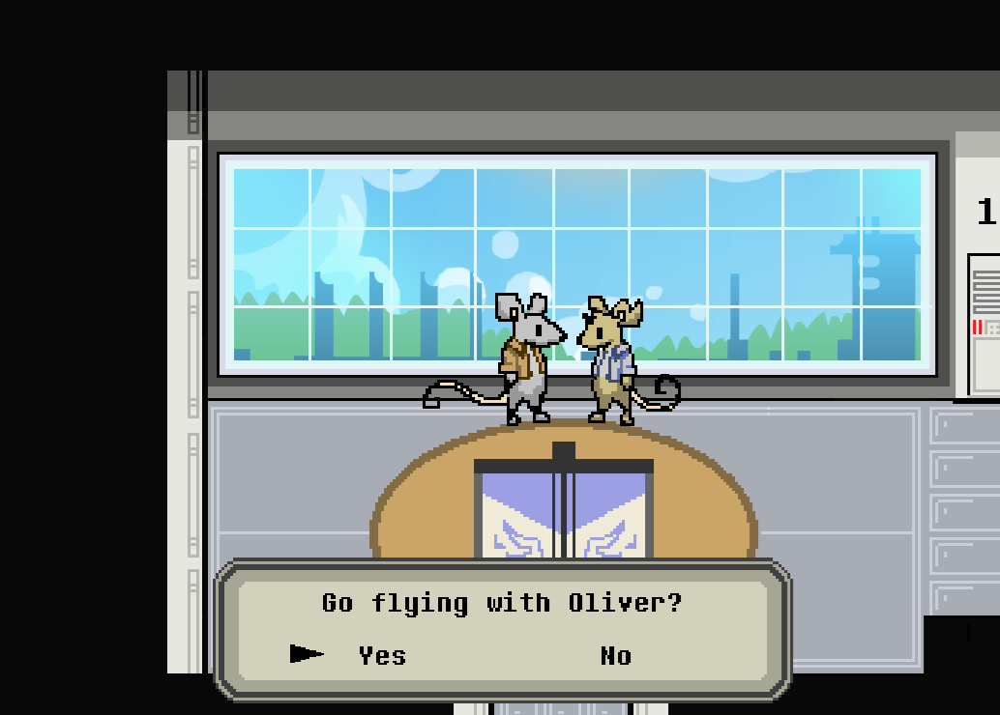
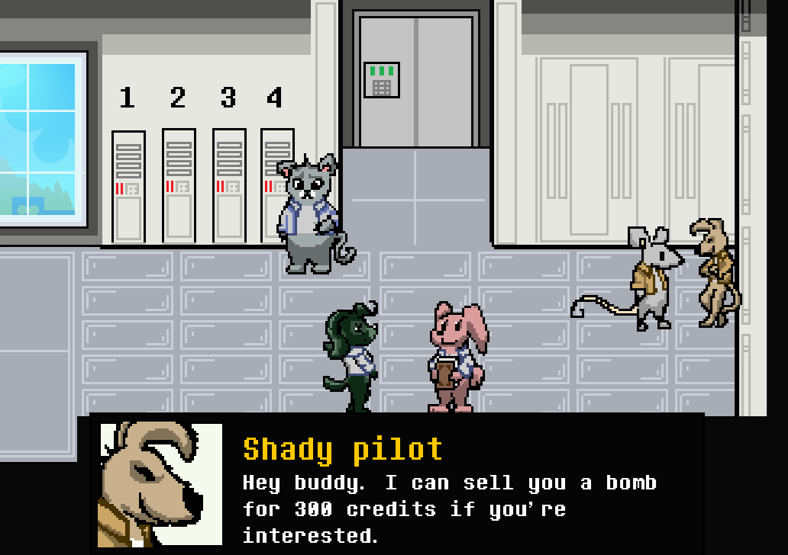
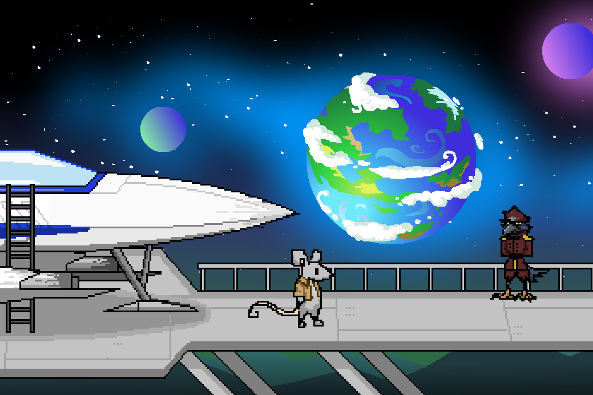
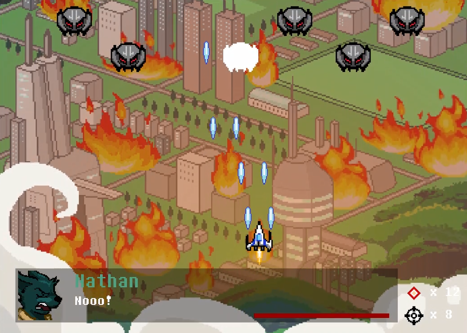
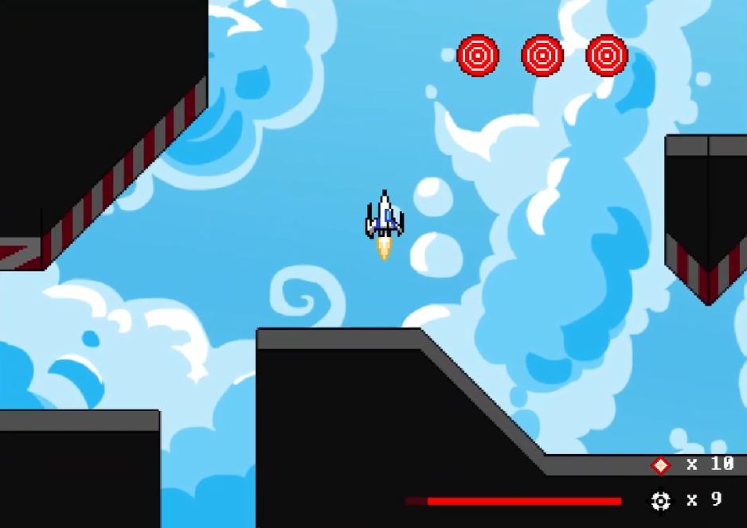
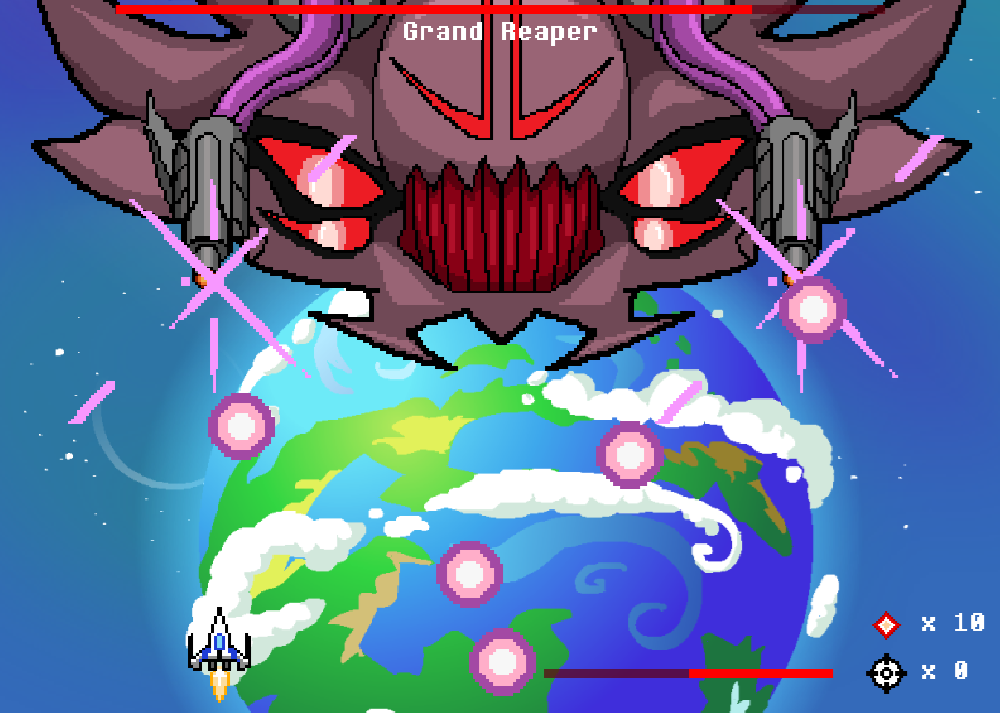
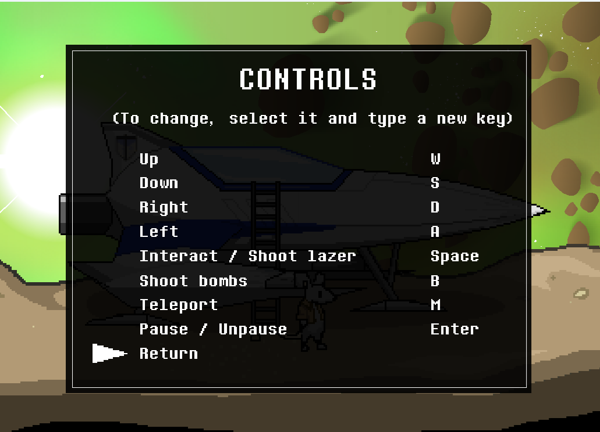

# StarMouse

StarMouse is a 2D shooter- / exploration game made by Jostein Sæle. It's currently work-in-progress.

## Description

Inspired by StarFox 64 and Undertale, StarMouse is a fun and colorful space adventure, combining intense and demanding space battles with exploration-based story segments.
It's a one-man project, with programming, visual artwork, animation, music and story all made by Jostein Sæle.
Aiming to be a 3-5 hour game (with twists and turns along the way), it's a big undertaking, and I cannot guarantee that the game will ever be finished.

## Usage

- Java version 8 or later is required.
- At present its only possible to run the game if you have a clone of the repository on your computer.
  - (I'm aiming to make an executable jar-file available in the future).
- At present, the only branch available is the development branch, which may be in a inconsistent state due to testing.

## Disclaimer

This is a work-in-progress and **may contain bugs**. I do not guarantee that it will work on your computer.

## Screenshots

<h3>Title Screen</h3>

<h3>Max the mouse</h3>

<h3>Go flying with Oliver?</h3>

<h3>Talking to NPC's</h3>

<h3>Captivating visuals</h3>

<h3>Flying through obstacles</h3>

<h3>Intense battles</h3>

<h3>Boss Battle</h3>

<h3>Change controls at any time</h3>

